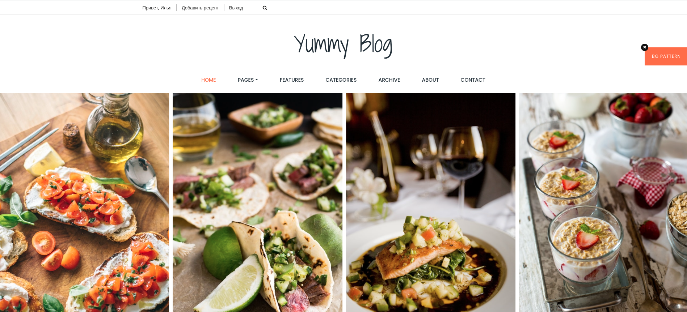
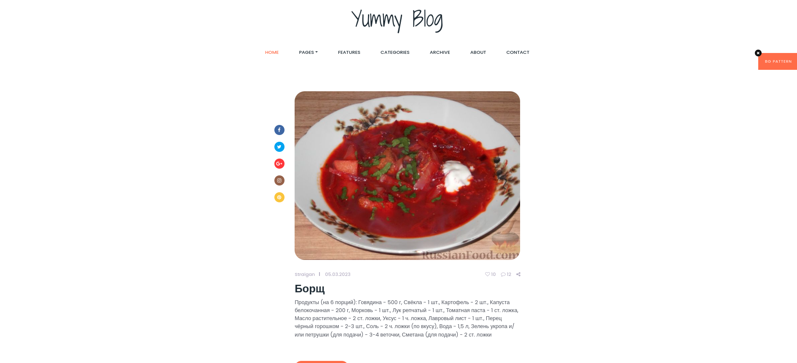
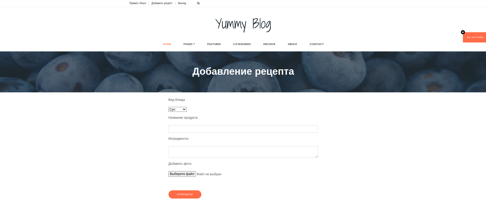

# Kitchen_recipes_flask

## Kitchen_recipes_flask - это web-приложение на Flask, которое является сборником рецептов.

# Сборка репозитория и локальный запуск

Выполните в консоли:

git clone https://github.com/Straigan/kitchen_recipes_flask.git
pip install -r requirments.txt

##  Настройка

Создайте файл .env и добавьте туда следующие настройки:

DATABASE_URL='адрес до БД'
SECRET_KEY='секретный ключ для FLASK'
FLASK_APP='webapp'

Рассылка почты осуществляется с помощью библиотеки - smtplib.

MAIL_SERVER='SMTP адрес почтового сервера'
MAIL_PORT='порт SMTP почтового сервера'
MAIL_USERNAME='логин пользователя с помощью которого осуществляется рассылка'
MAIL_PASSWORD='пароль пользователя'

Для выполнения ассинхронных задач используется celery + redis, например при
отправке письма пользователю после регистрации на сайте:

REDIS_HOST='адрес redis сервера'
REDIS_PORT='порт redis сервера'

## Наполнение базы данных

Из корня проекта запустите скрипт создания базы данных:  
python3 create_db.py

Далее для наполнения базы данных запустите скрипты:  
copy_dataset_in_db.py

## Запуск

Чтобы запустить web-приложение, выполните в консоли:  
run.sh